# Synthetic case study on the state-of-the-art samplers for imbalanced learning

This repository provides the code necessary to design an graphical analysis of the best sampling methods for imbalanced classification. With it, a binary synthetic data set with a chess board distribution can be constructed with the number of instances and the imbalanced ratio desired, tuning the parameters of the program. This dataset is preprocessed by the most relevant methods published in [Python](https://www.python.org)  and  [CRAN of R](https://cran.r-project.org). The results are plotted together with the classification surfaces inferred by the [Scikit-Learn's decision tree](http://scikit-learn.org/stable/modules/tree.html#classification). 

The repository contains the following files:

- **plot_synthetic.py** generates the synthetic data and executes all the sampling methods of the [imblearn package](http://contrib.scikit-learn.org/imbalanced-learn/index.html).  Its parameters goes as followed:

  - 1st parameter (*div*): shape of the chess board.
  - 2nd parameter (*N*): number of instances for the balanced dataset (N/2 for each class).
  - 3rd parameter (*per*): percentage of instances that conform the imbalanced data set (value in [0,1]).

- **plot_syntheticMWMOTE.py** does the same as *plot_synthetic.py*, but with the [MWMOTE](https://github.com/yen-von/MWMOTE) method.
- **MWMOTE.py** implements the [MWMOTE](http://ieeexplore.ieee.org/document/6361394/) method provided in its [GitHub repo](https://github.com/yen-von/MWMOTE).
- **smotesData.R** executes other important over-sampling methods implemented in the [smotefamily](https://cran.r-project.org/web/packages/smotefamily/index.html) package of R and [ROSE](https://cran.r-project.org/web/packages/ROSE/index.htmll)
- **plot_file.py** plots the results obtained with  *smotesData.R*, giving the generated files as parameter.

## Included Methods and some examples
Starting from the a 4x4 Chess data with 1000 instances and 10% of the minority class (*div=5*; *N=1000*; *per=0.1*): 

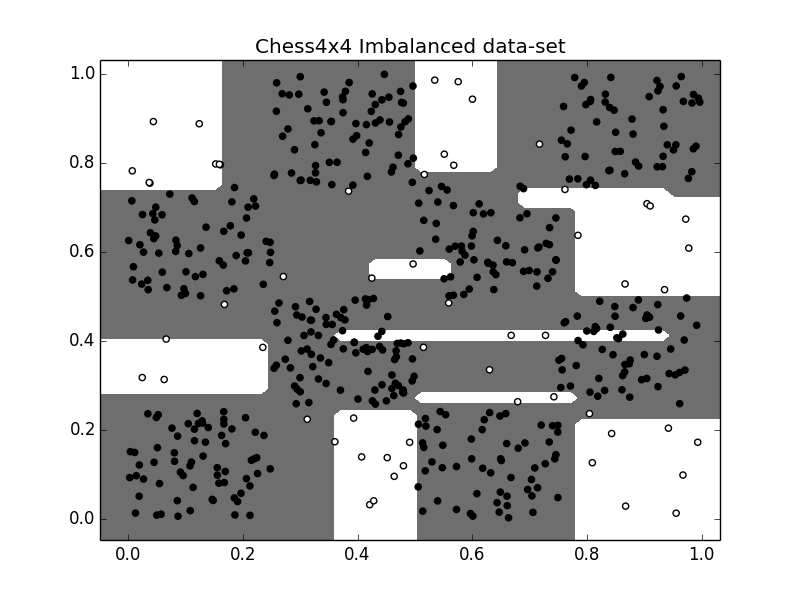
### Over-sampling methods

 - ADASYN ([imblearn package](http://contrib.scikit-learn.org/imbalanced-learn/index.html), default parameters)
 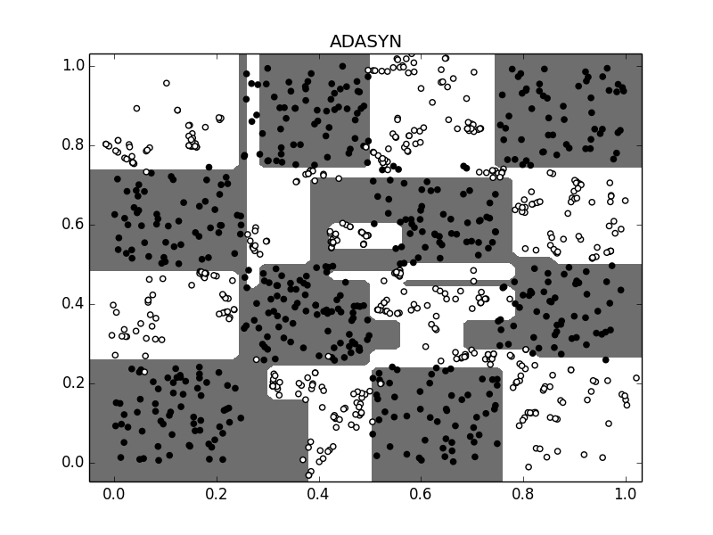
 - BLSMOTE ([smotefamily R package](https://cran.r-project.org/web/packages/smotefamily/index.html), default parameters)
 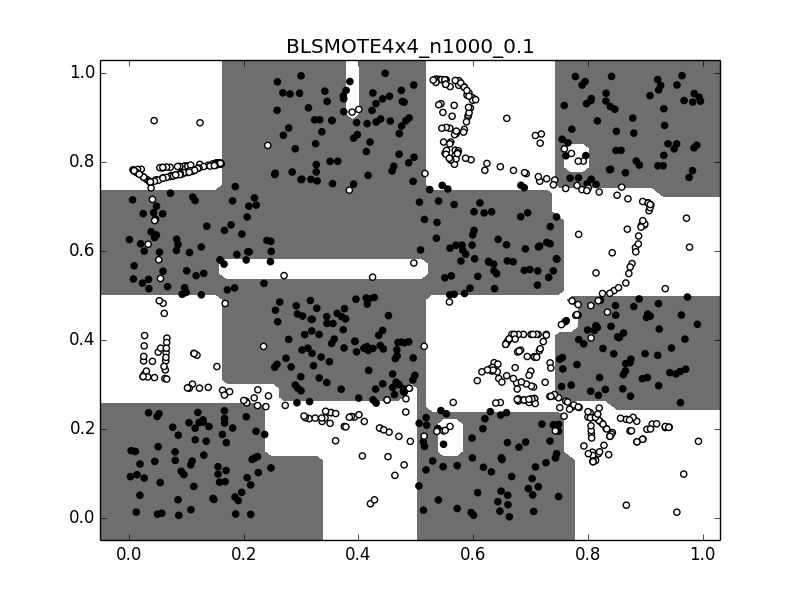
 - DBSMOTE ([smotefamily R package](https://cran.r-project.org/web/packages/smotefamily/index.html), default parameters)
 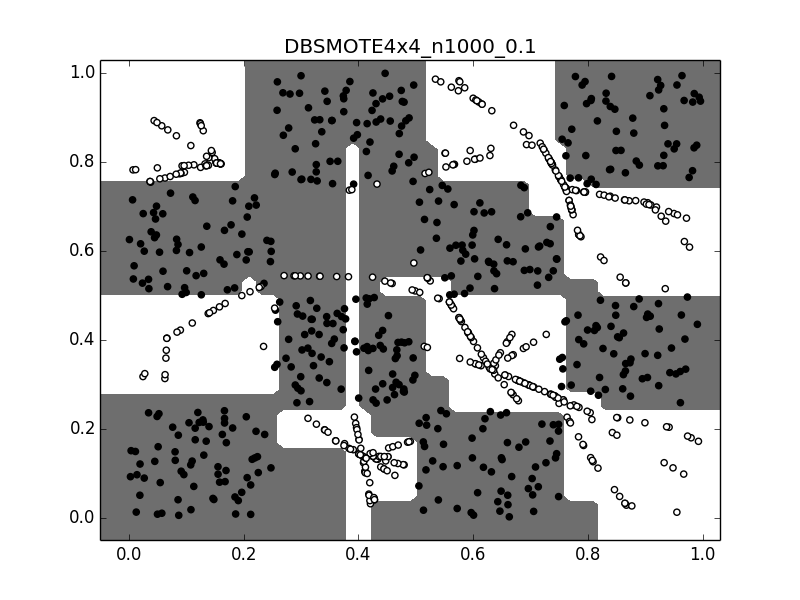
 - MWMOTE ([MWMOTE GitHub repo](https://cran.r-project.org/web/packages/smotefamily/index.html), #Synthetic(N)=400)
 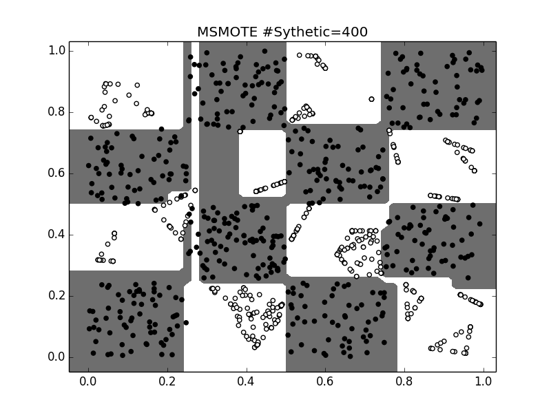
 - ROSE ([ROSE R package](https://cran.r-project.org/web/packages/ROSE/index.htmll), hmult.majo=0.1, hmult.mino=0.1)
 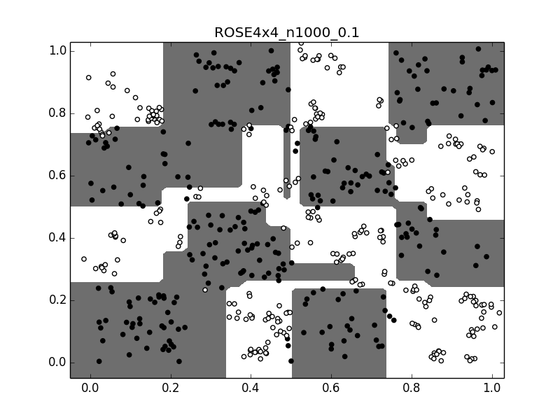
 - RSLS ([smotefamily R package](https://cran.r-project.org/web/packages/smotefamily/index.html), default parameters)
 
 - SLS ([smotefamily R package](https://cran.r-project.org/web/packages/smotefamily/index.html), default parameters)
 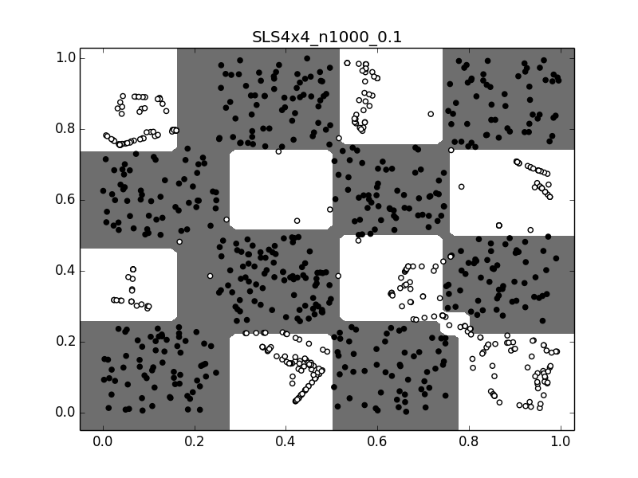
 - SMOTE ([imblearn package](http://contrib.scikit-learn.org/imbalanced-learn/index.html), default parameters)
 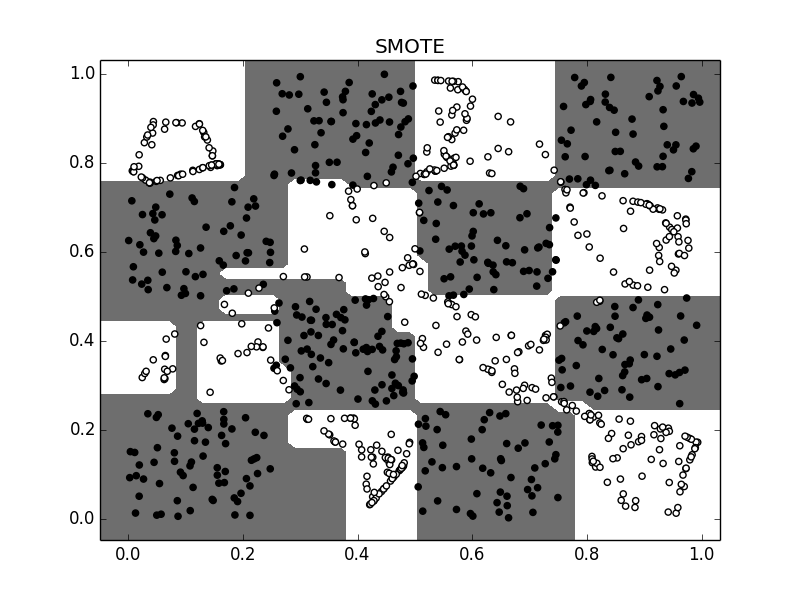
 - SMOTEENN ([imblearn package](http://contrib.scikit-learn.org/imbalanced-learn/index.html), default parameters)
 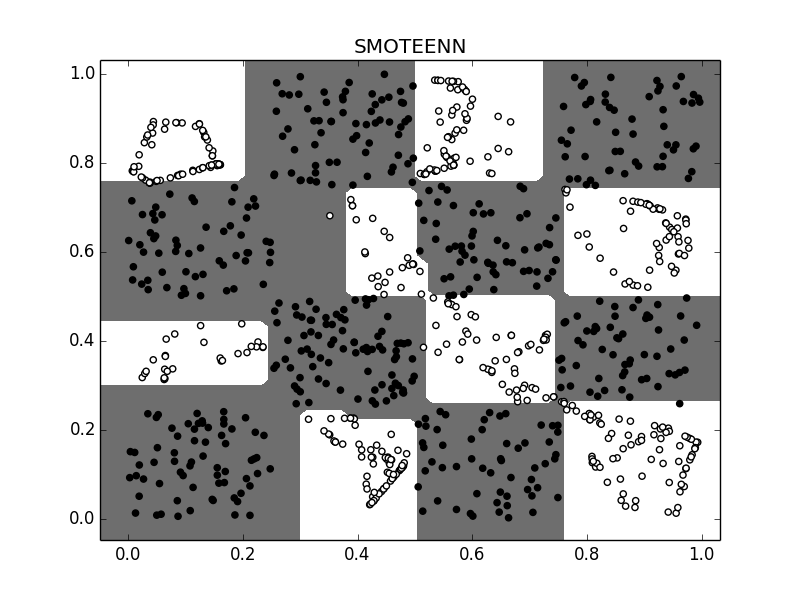
 - SMOTETomek ([imblearn package](http://contrib.scikit-learn.org/imbalanced-learn/index.html), default parameters)
 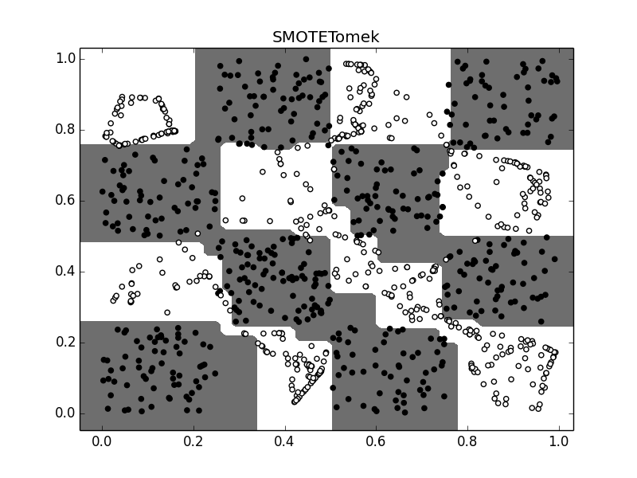

### Under-samping methods
- IHT ([imblearn package](http://contrib.scikit-learn.org/imbalanced-learn/index.html), default parameters)

- NCL ([imblearn package](http://contrib.scikit-learn.org/imbalanced-learn/index.html), n_neighbors=20)
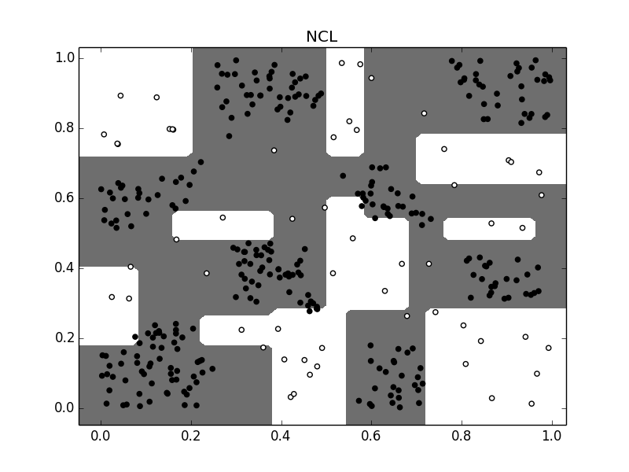
- OSS ([imblearn package](http://contrib.scikit-learn.org/imbalanced-learn/index.html), k=1, n_seeds_S=100)
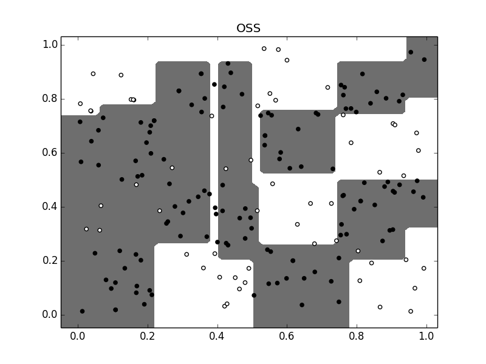
